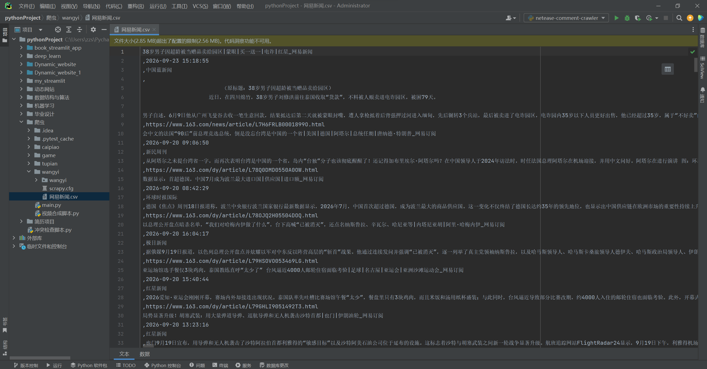

# scrapy-news-spider

## 项目简介

基于 Scrapy 框架的新闻文章采集系统，针对网易新闻首页，自动提取文章链接并进入详情页，抓取标题、发布时间、作者、正文和原文链接，最终通过 Pipeline 写入 CSV 文件。

## 技术栈

- Python
- Scrapy
- XPath
- CSV 存储

## 功能说明

- 从网易新闻首页自动提取文章链接，并过滤掉图片、视频等非文章页面
- 进入详情页抓取标题、发布时间、作者、正文和原文链接
- 适配多种页面结构，兼容不同模板的新闻页面
- 使用 Pipeline 将数据实时写入 CSV 文件
- 配置了 User-Agent 与 ROBOTSTXT_OBEY 策略，降低被封禁风险

## 运行方式

1. 安装依赖：`pip install scrapy`
2. 进入项目目录：`cd wangyi`
3. 运行爬虫：`scrapy crawl news`
4. 数据会自动保存到 `./网易新闻.csv`

## 运行结果
成功爬取网易新闻首页的文章，提取标题、发布时间、作者、正文和原文链接，并保存为 CSV 文件。

